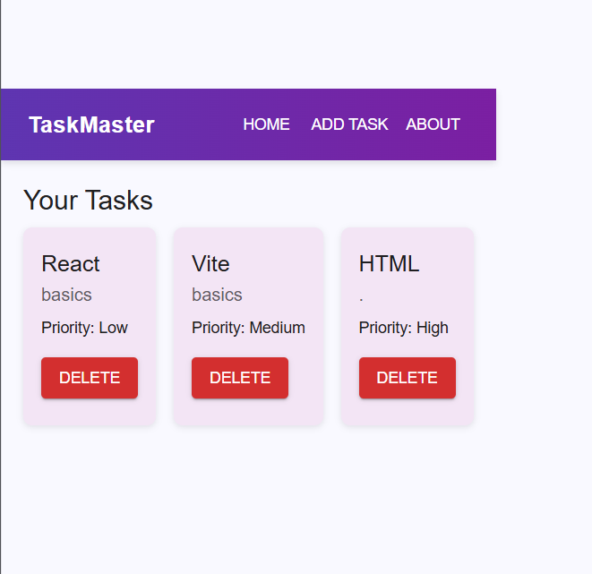
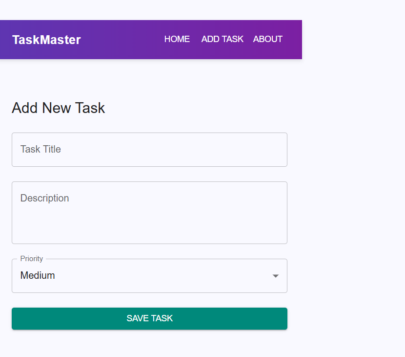
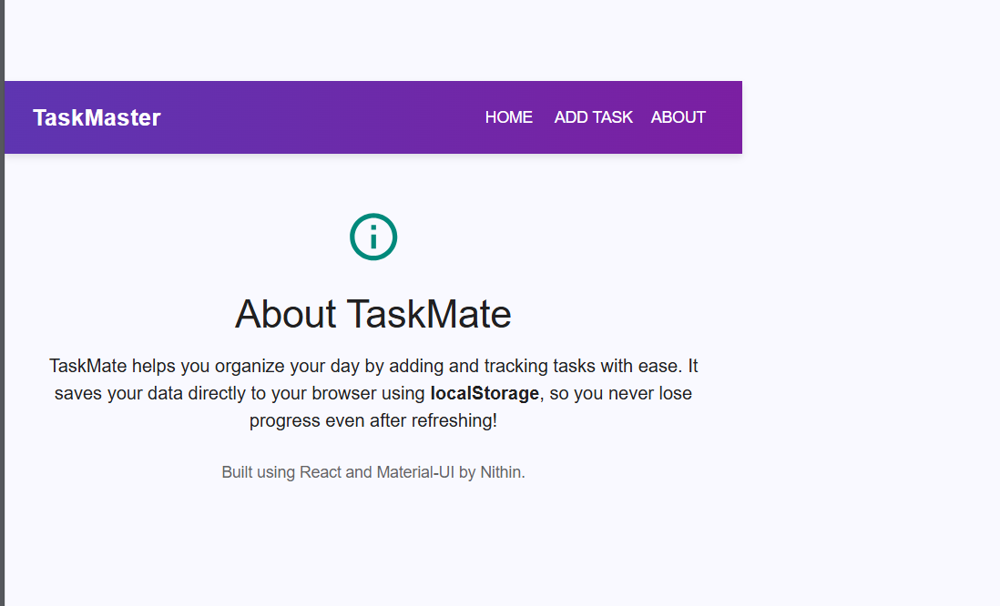

# Tasktracker - Internship Project (Day 4)(week 2)

## Overview
Tasktracker is a simple task management app built with **React**, **React Router**, and **Material-UI**.  
It allows users to add, view, and delete tasks while keeping data persistent using **localStorage**.  
The app demonstrates routing, state management, UI optimization, and theming.

## Features
- **Routing:** Navigate between Home, Add Task, and About pages using React Router.
- **Task Management:** Add new tasks, view them in a list, and delete unwanted tasks.
- **Persistent Storage:** Tasks are saved to localStorage and loaded automatically on page load.
- **UI & Theming:** Clean and responsive UI using Material-UI components with custom theme and colors.
- **Icons:** MUI icons used to enhance visual experience.

## Folder Structure
src/
┣ components/
┃ ┗ Navbar.jsx
┣ pages/
┃ ┣ Home.jsx
┃ ┣ AddTask.jsx
┃ ┗ About.jsx
┣ App.jsx
┗ main.jsx

## How it works
1. Navigate between pages using the Navbar.  
2. On the Add Task page, fill in the task title, description, and priority.  
3. Click "Save Task" to store it in localStorage.  
4. Home page displays all tasks automatically.  
5. Tasks persist even after refreshing the page.  

## Learning Outcomes
- Implemented **React Router** for multiple page navigation.  
- Managed state using **useState** and **useEffect**.  
- Saved and retrieved data using **localStorage**.  
- Built forms with **MUI TextFields and Buttons**.  
- Applied **theming and styling** with Material-UI.  
- Optimized UI for better user experience.

