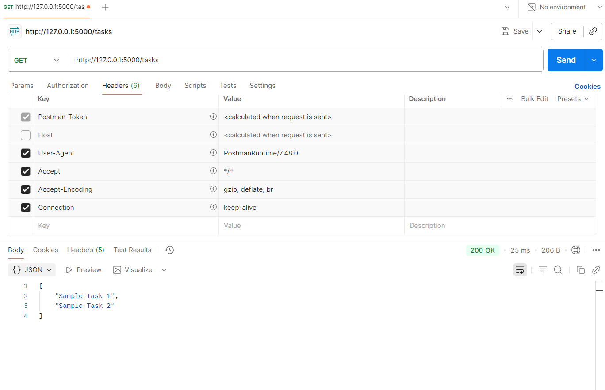
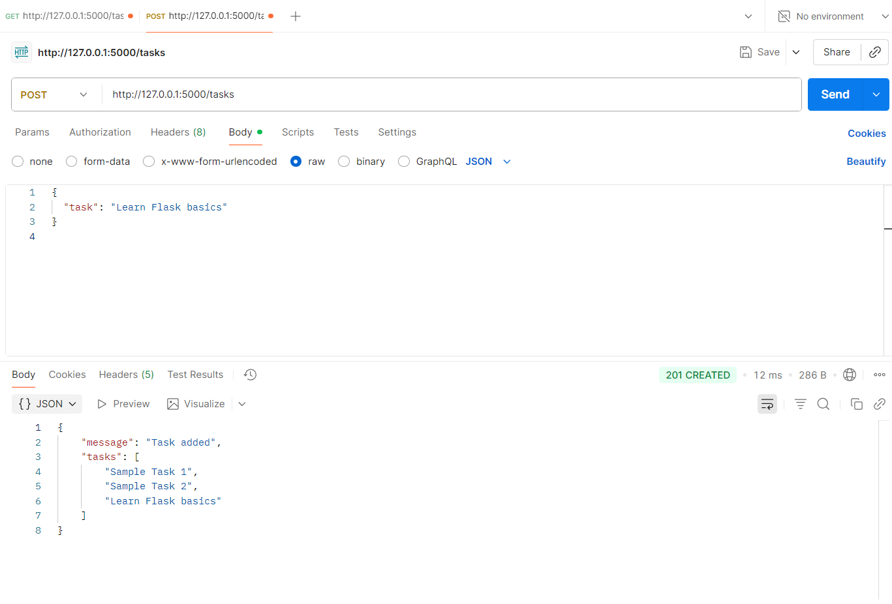

In this task, I learned how to create a simple Flask backend project.
First, I installed Flask and set up a proper folder structure with an app folder, routes file, and main.py as the entry point.
Then I created a basic “Hello World” route to confirm that Flask was running properly.
After that, I implemented two REST endpoints:

GET /tasks → to fetch some sample tasks stored in memory.

POST /tasks → to add a new task (tested using Postman).

```bash
flask_tasks/
│
├── app/
│   ├── __init__.py
│   ├── routes.py
│   ├── static/
│   └── templates/
│
├── venv/
├── main.py
└── requirements.txt
```

At first, Flask didn’t run because the file paths were wrong.
Then I got the error “No such file or directory main.py” — I fixed it by creating the file inside the right folder.
Later, when testing in Postman, I got errors like “ECONNREFUSED 127.0.0.1:5000” and “Content-Type must be application/json”.
I learned that Flask should be running in VS Code before sending requests from Postman, and I had to select raw → JSON in Postman for POST requests.
After fixing these, both GET and POST routes worked correctly.

GET /tasks → returned dummy task list

POST /tasks → successfully added a new task to the list


