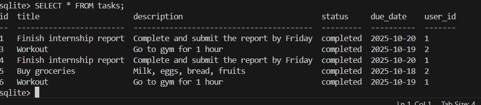

# Internship Assignment: SQLite Tasks Database

## **Objective**
The goal of this assignment was to design a database schema for managing tasks and perform basic SQL operations using SQLite. The database includes task information such as title, description, status, due date, and assigned users.

---

## **Steps Performed**

1. **Setup and Installation**
   - Downloaded SQLite precompiled tools (`sqlite-tools-win-x64-3500400.zip`) from the official website.
   - Extracted the ZIP to the folder:  
     `C:\Users\nithi\OneDrive\Documents\AeroAspire\week4\day1\sqlite`
   - Opened **VS Code** and used the integrated terminal to navigate to the folder.

2. **Creating the Database**
   - Started SQLite CLI using:
     ```powershell
     .\sqlite3.exe task_manager.db
     ```
   - This created the database file `task_manager.db` in the same folder.

3. **Designing Schema**
   - Created a `tasks` table with the following fields:
     - `id` (INTEGER, Primary Key, Auto-increment)
     - `title` (TEXT, required)
     - `description` (TEXT)
     - `status` (TEXT, default: 'pending')
     - `due_date` (DATE)
     - `user_id` (INTEGER, optional for task assignment)
   - Created a `users` table to store user information (id, name, email) and linked tasks via `user_id`.

4. **Inserting Sample Data**
   - Added several sample tasks using `INSERT INTO` commands.
   - Added sample users and assigned some tasks to users.

5. **Querying and Updating**
   - Queried all tasks using `SELECT * FROM tasks;`
   - Filtered tasks by status and due date.
   - Updated task status using `UPDATE` and deleted unnecessary tasks using `DELETE`.
   - Verified updates by re-querying the table.

6. **Optional Enhancements**
   - Added `user_id` to assign tasks to users.
   - Used `LEFT JOIN` to display tasks along with assigned user names.

---

## **Output**
The database now contains:
- A fully functional `tasks` table with sample data.
- Optional `users` table linked to tasks.
- Queries for viewing, updating, deleting, and assigning tasks.

Sample output from CLI:

| id | title                     | description                               | status     | due_date    | user_id |
|----|---------------------------|-------------------------------------------|------------|------------|---------|
| 1  | Finish internship report  | Complete and submit the report by Friday | completed  | 2025-10-20 | 1       |
| 3  | Workout                   | Go to gym for 1 hour                      | completed  | 2025-10-19 | 2       |
| 4  | Finish internship report  | Complete and submit the report by Friday | completed  | 2025-10-20 | 1       |
| 5  | Buy groceries             | Milk, eggs, bread, fruits                 | completed  | 2025-10-18 | 2       |
| 6  | Workout                   | Go to gym for 1 hour                      | completed  | 2025-10-19 | 1       |

---

## **Problems Faced**
1. Initially tried MySQL but it required **Visual Studio 2019** and other heavy dependencies, making installation difficult.
2. Navigating folder paths in VS Code terminal caused `cd` errors until the correct extraction folder was identified.
3. Understanding SQLite CLI output formatting (default `|` separated) — resolved by using `.mode column` and `.headers on` for better readability.

---

## **Conclusion**
- Successfully created a SQLite database to manage tasks.
- Learned how to create tables, insert, update, delete, and query data.
- Learned how to assign tasks to users and use JOIN operations.
- Gained experience in using SQLite CLI inside VS Code terminal.


