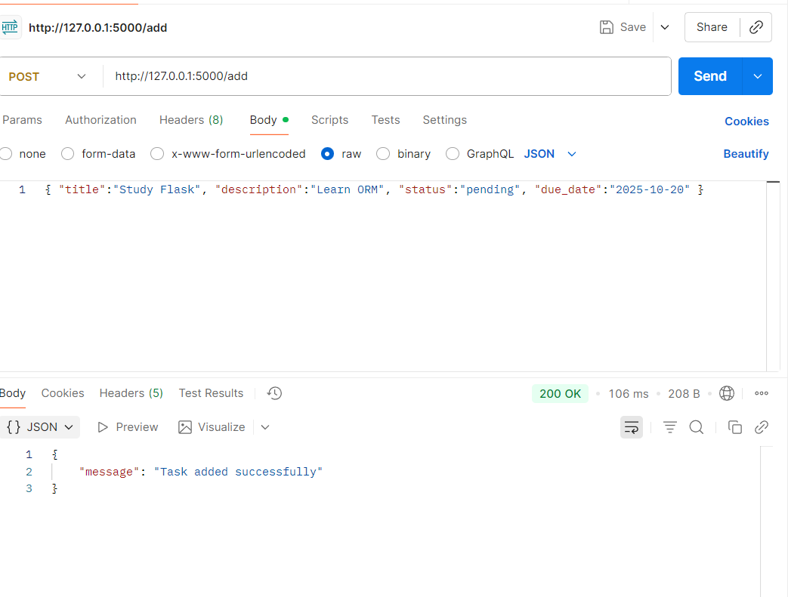
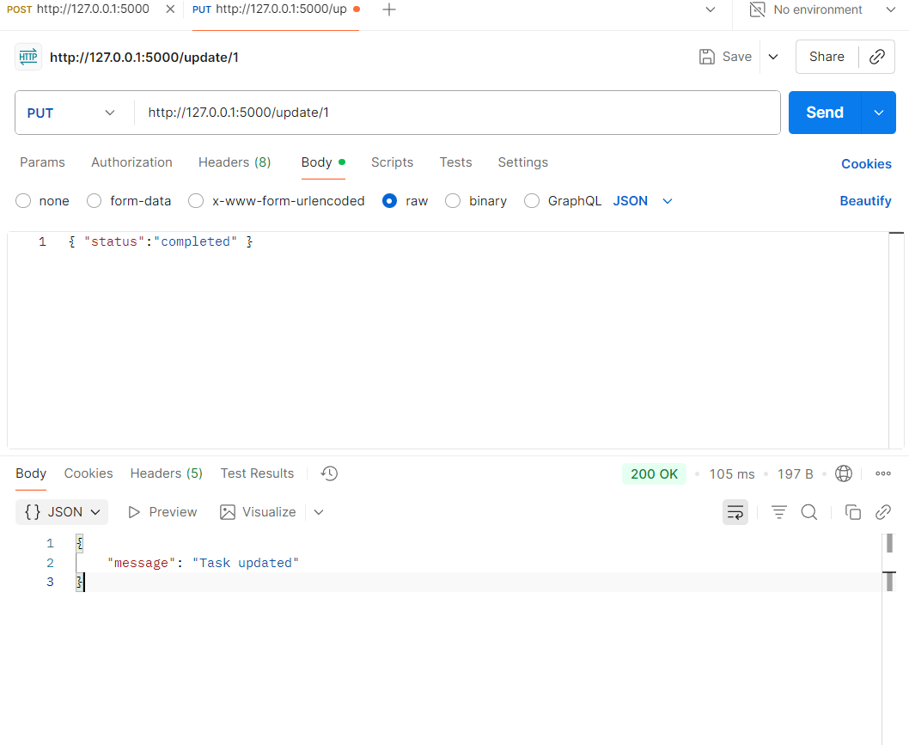
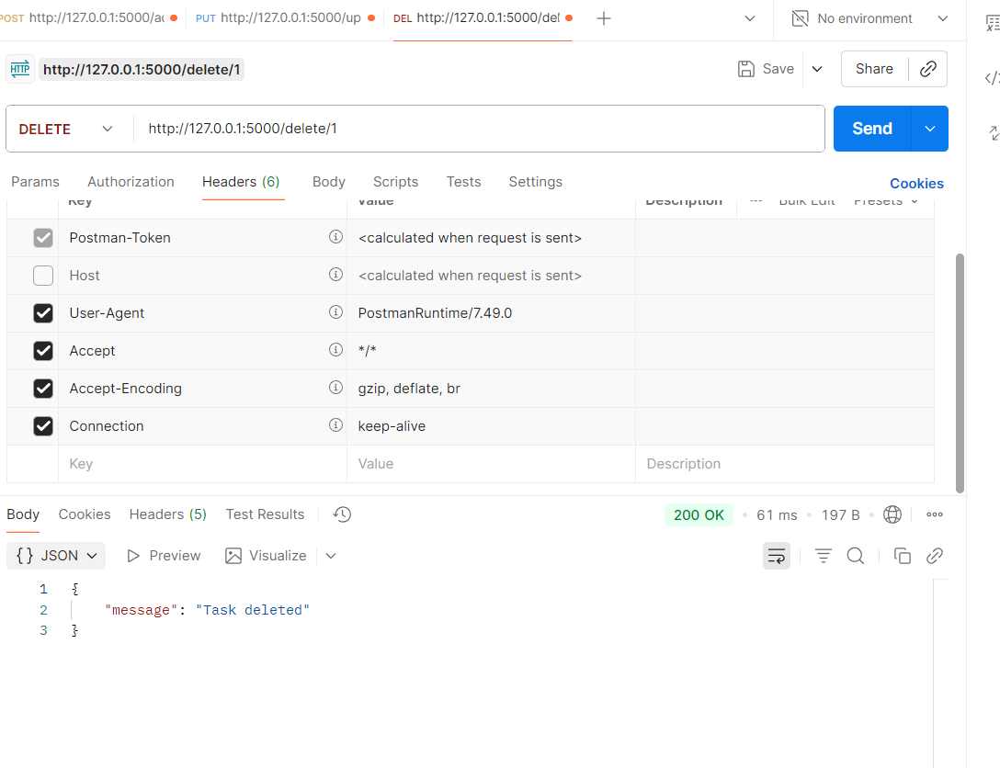

Flask Database Integration (ORM vs Direct SQL)

Topic:
DB Integration; ORM vs Direct SQL

Overview:
This task focuses on integrating a Flask web application with a database using SQLite and implementing CRUD operations with SQLAlchemy ORM instead of direct SQL queries.

Steps Followed:

Created a new Flask project folder named AeroAspire-Flask-DB.

Installed Flask and SQLAlchemy using the command:
pip install flask flask_sqlalchemy

Configured the Flask application (app.py) to connect with a SQLite database.

Created a models.py file and defined a Task model using SQLAlchemy ORM.

Implemented CRUD operations including creating, reading, updating, and deleting tasks.

Verified functionality by testing endpoints locally and using Postman for validation.

Folder Structure:
AeroAspire-Flask-DB/
│
├─ app.py — Main Flask application
├─ models.py — ORM model definitions
├─ database.db — SQLite database file (auto-created)
├─ templates/ — HTML templates (optional)
└─ static/ — Static assets (optional)

Technology Used:

Python

Flask Framework

SQLite Database

SQLAlchemy ORM

Implemented Endpoints:

Method	Endpoint	Description
GET	/	Fetch all tasks
POST	/add	Add a new task
PUT	/update/<id>	Update existing task
DELETE	/delete/<id>	Delete task by ID

Example request body for adding a new task:

{
  "title": "Workout",
  "description": "Go to gym for 1 hour",
  "status": "pending"
}

Key Learnings:

Learned how to integrate Flask with SQLite.

Understood the difference between ORM and direct SQL.

Learned how ORM simplifies database management.

Gained practical experience implementing CRUD operations in Flask.

Understood how to test API endpoints using Postman.

Problems Faced and Solutions:

Problem	Solution
pip not recognized	Added Python Scripts path to environment variables
Flask not running	Installed Flask using pip
Database not showing	Added db.create_all() to initialize tables
Data not updating	Corrected the logic in the update route

Output Summary:

Flask server successfully connected to SQLite.

CRUD operations working correctly.

Database entries verified in the SQLite CLI.

Execution:
To run the application:

Open terminal in the project folder.

Run the command: python app.py

Open the browser and go to http://127.0.0.1:5000/

