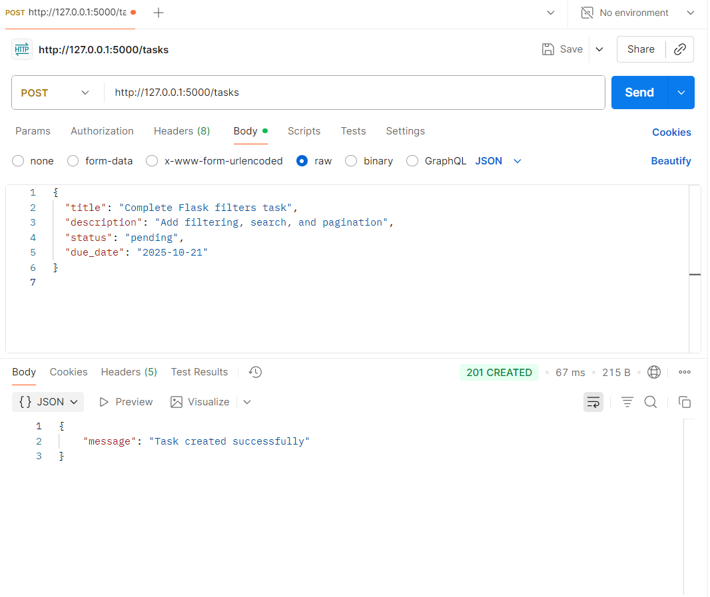
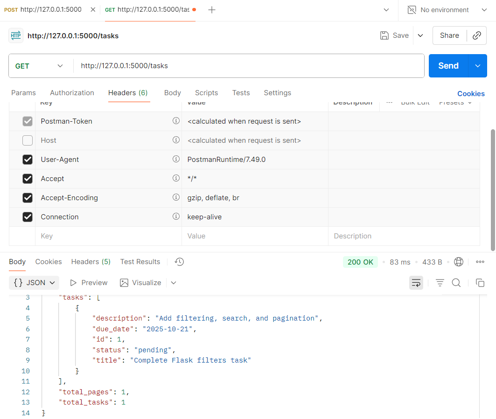
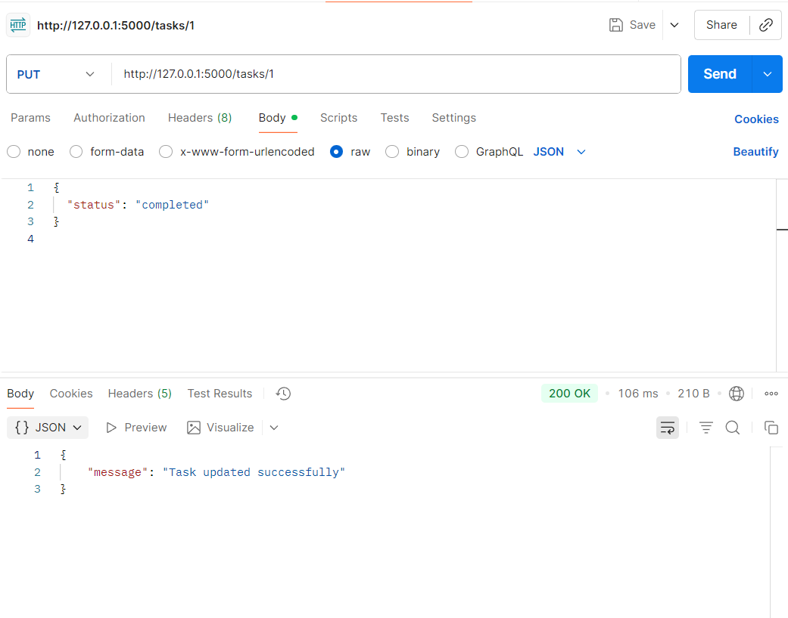
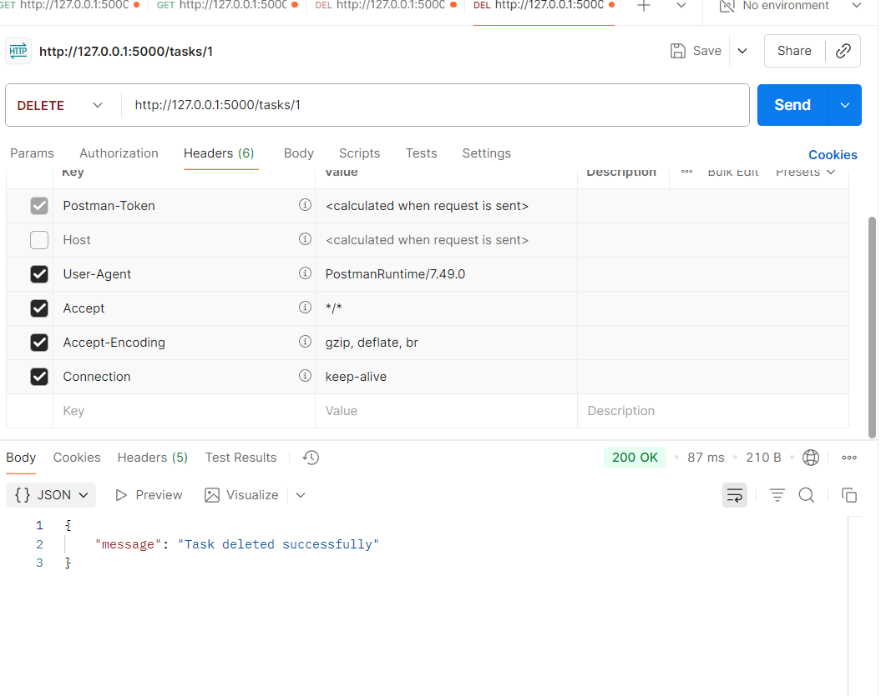

Objective

The objective of this task was to implement filtering, search, and pagination features in a Flask API connected to an SQLite database. The task focused on using query parameters for dynamic data retrieval.

Learning Topic

Filtering / Search; Query Parameters; Indexing Basics

Tools and Technologies Used:-

Flask (Python web framework)
SQLite (lightweight database)
Flask-SQLAlchemy (ORM for database handling)
Postman (for API testing)
VS Code (for development)

Steps Followed

Created a new project folder named day3_flask_filters.

Installed dependencies using:-
Steps Followed

Created a new project folder named day3_flask_filters.

Installed dependencies using:-

python -m pip install flask flask_sqlalchemy

1.Set up the Flask app and configured SQLite database connection.

2.Created the Task model with fields: id, title, description, status, and due_date.

3.Added sample data to the database for testing.

4.Implemented filtering and search features:

5.Filter by status → /tasks?status=pending

6.Filter by due_date → /tasks?due_date=2025-10-21

7.Search by title → /tasks?search=Flask

8.Implemented pagination using query parameters:

Example: /tasks?page=1&limit=5

Tested all endpoints in Postman using the GET method.

Verified correct output and confirmed all features worked as expected.

| Method | Endpoint                     | Description              |
| ------ | ---------------------------- | ------------------------ |
| GET    | `/tasks`                     | Fetch all tasks          |
| GET    | `/tasks?status=pending`      | Filter tasks by status   |
| GET    | `/tasks?due_date=2025-10-21` | Filter tasks by due date |
| GET    | `/tasks?search=Flask`        | Search tasks by title    |
| GET    | `/tasks?page=1&limit=5`      | Apply pagination         |

Challenges Faced

Understanding how query parameters work with Flask routes.

Ensuring filtering and search logic worked together properly.

Managing pagination calculations for total pages and limits.

The Flask application successfully supports:

Filtering by status and due date

Searching tasks by title

Pagination using query parameters

All features were verified through Postman requests and produced accurate results.

