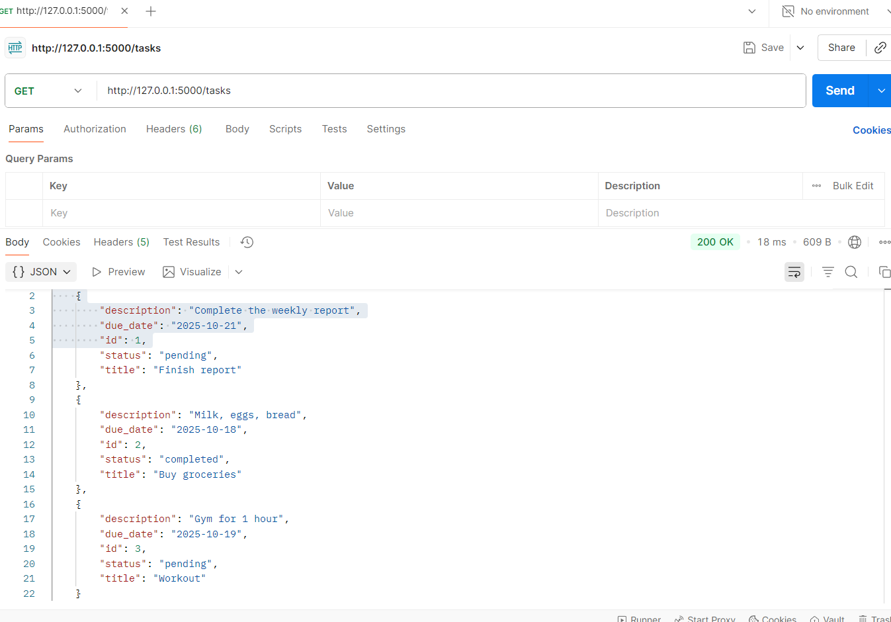
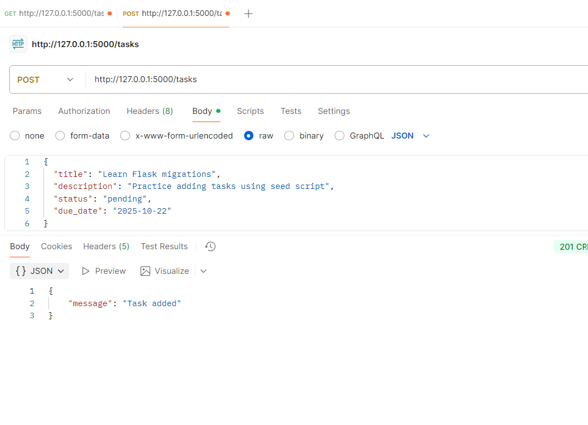
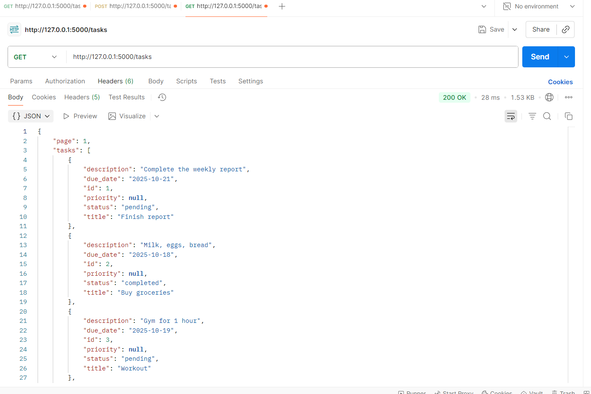
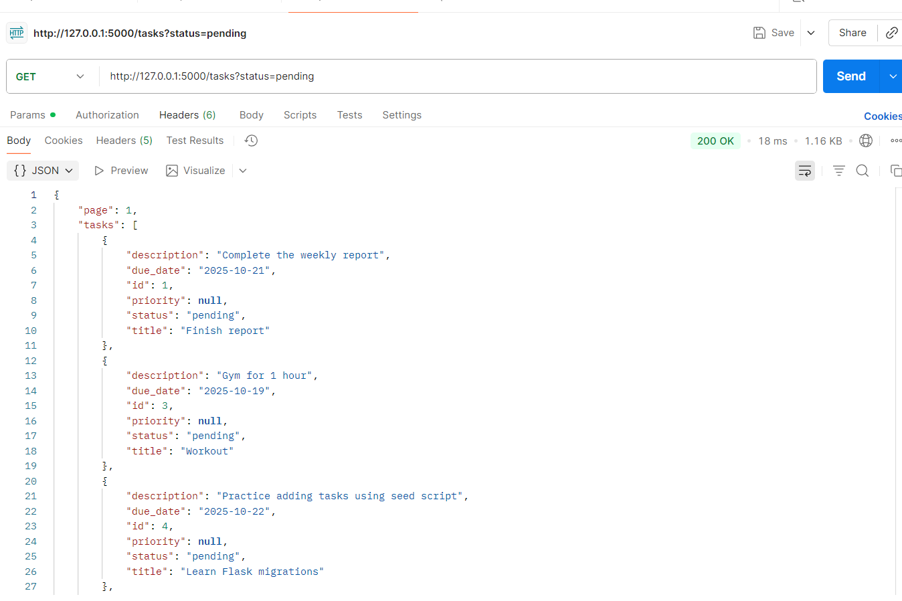
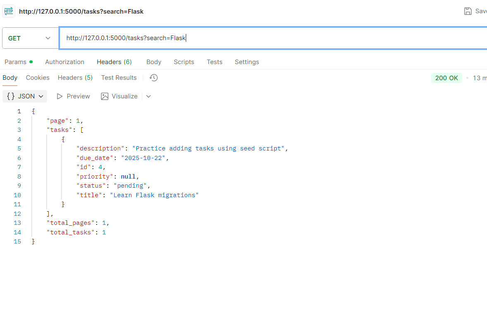
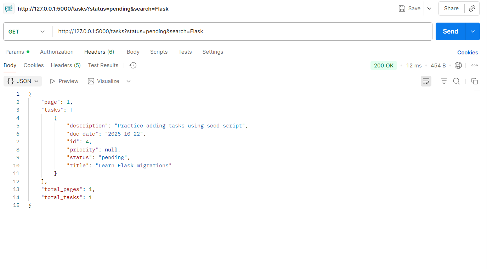
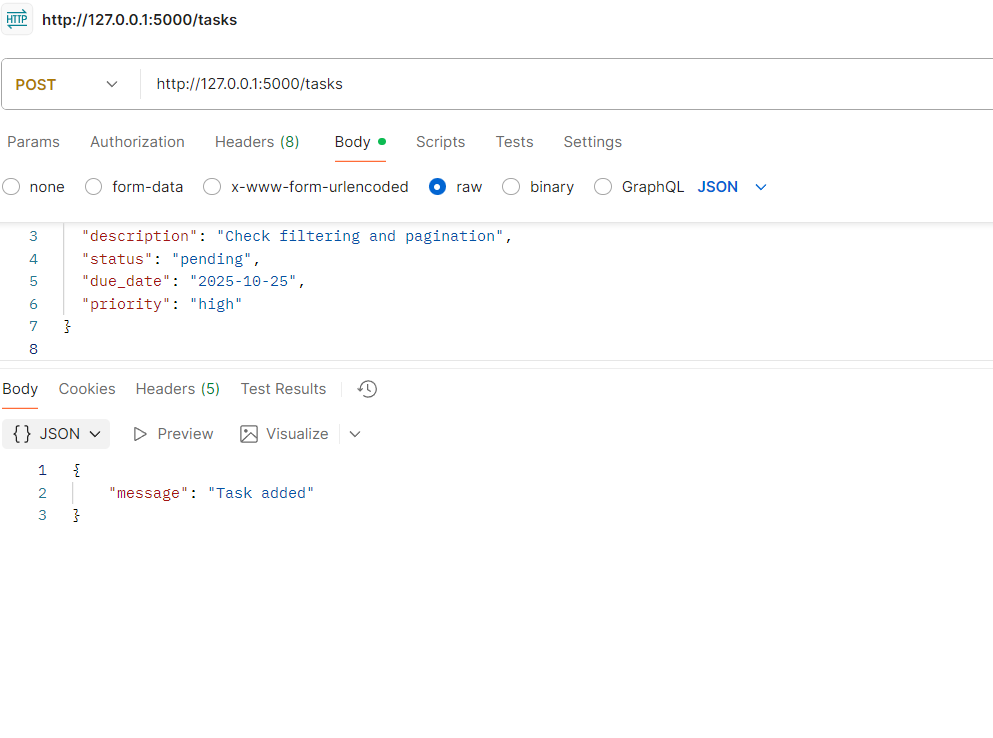

Flask Migrations and Seed Script Task

This project demonstrates using Flask-Migrate to handle database migrations and a simple Python script to seed a SQLite database. The goal was to set up a Flask application with a tasks table, implement migrations for schema changes, and populate the database with initial data.

Project Structure

AeroAspire-Flask-Migrations/
│
├─ app.py main Flask application with CRUD endpoints
├─ models.py ORM models for the tasks table
├─ seed.py script to insert seed data into the database
├─ database.db SQLite database (auto-created)
├─ migrations/ Flask-Migrate files (auto-created)
└─ requirements.txt project dependencies

Setup and Installation

.venv\Scripts\Activate.ps1   # For PowerShell

Install required packages:
python -m pip install flask flask_sqlalchemy flask_migrate

Initialize Flask-Migrate (if not already done):
flask db init

Create migration for schema changes:
flask db migrate -m "Add priority column"

Apply migration to the database:

flask db upgrade

Seed the database with initial data:
python seed.py

Endpoints

GET /tasks → Retrieve all tasks
POST /tasks → Add a new task

Features Implemented:-
Database setup using SQLite
ORM models with SQLAlchemy
Flask-Migrate for handling migrations
Migration example: adding priority column
Seed script to populate database with sample tasks
CRUD operations tested via Postman

Problems Faced and Solutions

Flask server not starting / ECONNREFUSED → Fixed by ensuring app.run(debug=True) was in if __name__ == '__main__': block.
Migrations not applied → Fixed by properly initializing Flask-Migrate and running flask db migrate and flask db upgrade.
Seed data not showing → Fixed by running python seed.py after migration.

