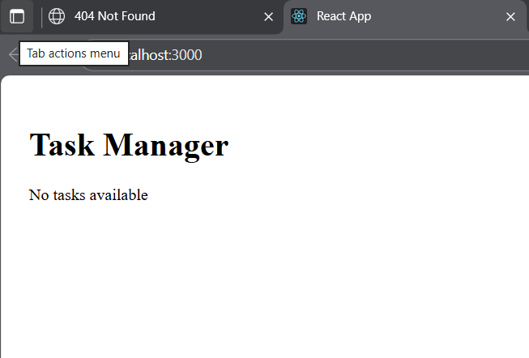
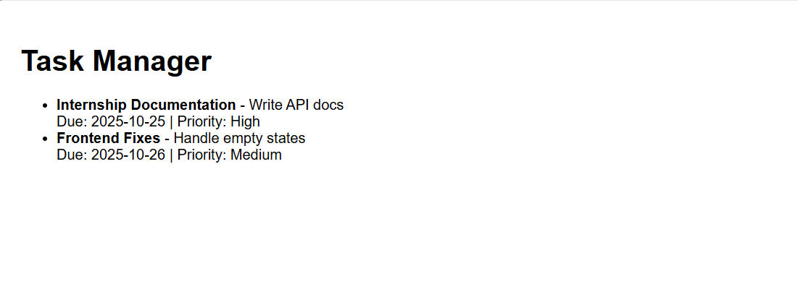

# Task Manager App

## Overview

A simple **Task Manager** web application built with **React** (frontend) and **Flask** (backend). The app connects to a **SQLite** database to store tasks. Currently, it handles **empty task lists** gracefully.

## Features

* Display tasks from the database
* Show “No tasks available” if the database is empty
* Connect React frontend to Flask backend
* Handles database connection errors

## Prerequisites

* Python 3.10+
* Node.js & npm
* Virtual environment for Python dependencies

## Setup Instructions

### 1. Clone the repository

```bash
git clone <your-repo-link>
cd week4/day5
```

### 2. Backend Setup

1. Create and activate virtual environment:

```bash
python -m venv .venv
.venv\Scripts\activate      # Windows
source .venv/bin/activate   # macOS/Linux
```

2. Install dependencies:

```bash
pip install flask flask_sqlalchemy flask_cors
```

3. Initialize the database:

```python
from app import db
db.create_all()
```

4. Run the backend:

```bash
flask run
```

* Access at: `http://127.0.0.1:5000`

### 3. Frontend Setup

1. Navigate to frontend folder:

```bash
cd frontend
```

2. Install dependencies:

```bash
npm install
```

3. Run the frontend:

```bash
npm start
```

* The app should open in the browser at `http://localhost:3000`
* If no tasks exist, you will see:

```
Task Manager
No tasks available
```

## Folder Structure

```
backend/
├─ app.py
├─ instance/
│  └─ database.db
├─ .venv/
frontend/
├─ src/
│  └─ App.jsx
├─ package.json
```

## Notes

* The app currently **does not have any tasks** in the database by default.
* To add tasks, insert them directly in the backend database using Python shell.
* Frontend handles empty states and backend connection errors.




